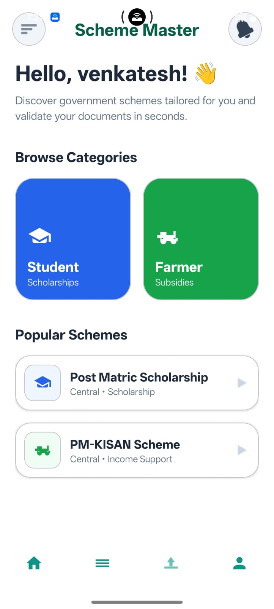
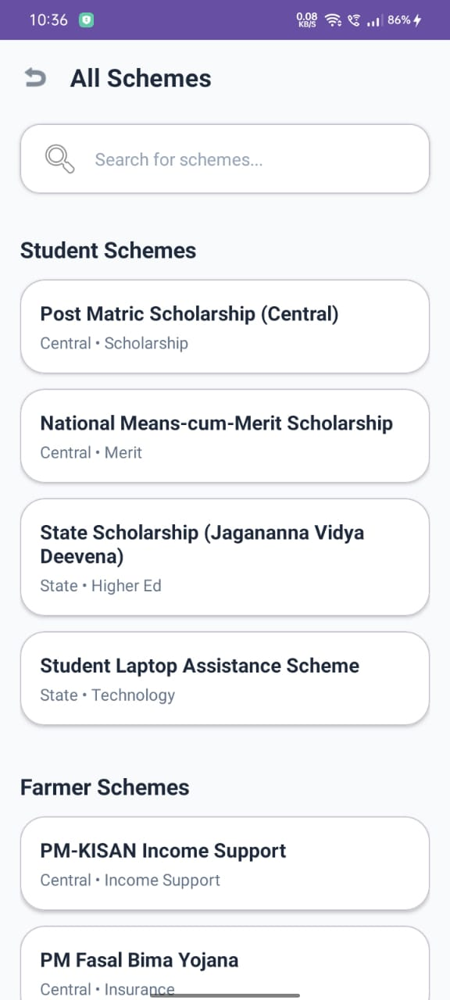
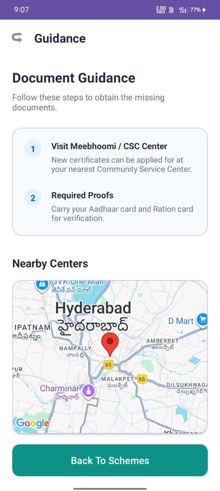
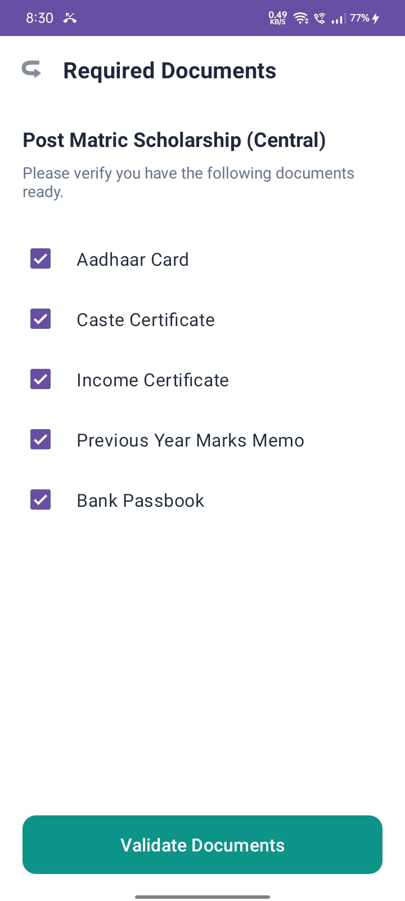

# 📱 SchemeMaster Android App

## 🚀 Overview

SchemeMaster is an Android application designed to help users discover government welfare schemes, check eligibility, and locate nearby service centers. The app focuses on solving real-world problems by making scheme information easily accessible, even in low-network conditions.

---

## ✨ Features

* 🔍 Search and explore government schemes
* ✅ Check eligibility criteria
* 📍 Locate nearby service centers using Google Maps
* 📡 Offline support using SQLite
* 📱 Simple and user-friendly interface

---

## 🛠️ Tech Stack

* **Frontend:** Kotlin, XML (Android)
* **Backend:** PHP, MySQL
* **APIs:** REST API integration
* **Other:** Google Maps API, SQLite

---

## 📸 Screenshots

Visual representation of key features:

## 📸 Screenshots

Visual representation of key features:

<p align="center">
  
  
  
  
</p>

---

## 🎥 Demo

📱 Watch the app in action:
👉 [Watch Demo on Instagram](https://www.instagram.com/reel/DTRl0EBAXtq/)

---

## ⚙️ Setup & Installation

1. Clone the repository

```
git clone github.com/VenkateshMarikanti/SchemeMaster-Android-App

## Backend

Backend APIs developed using PHP and MySQL.

🔗 Backend Repo: https://github.com/VenkateshMarikanti/Scheme-Master
```

2. Open the project in Android Studio

3. Sync Gradle and run the app on an emulator or physical device

---

## 📂 Project Structure

```
app/
 ├── java/
 ├── res/
 ├── AndroidManifest.xml
```

---

## 💡 Key Learnings

* Built a full-stack Android application with real-world use case
* Implemented REST API communication
* Integrated Google Maps for location-based services
* Developed offline functionality using SQLite

---

## 📌 Future Improvements

* Add user authentication (Firebase)
* Improve UI/UX design
* Deploy backend to cloud

---

## 👨‍💻 Author

**Venkatesh Marikanti**

* GitHub: https://github.com/VenkateshMarikanti
* LinkedIn: https://www.linkedin.com/in/venkateshm1

---

## 📄 License

This project is for learning and demonstration purposes.
